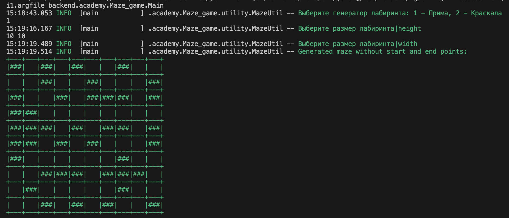
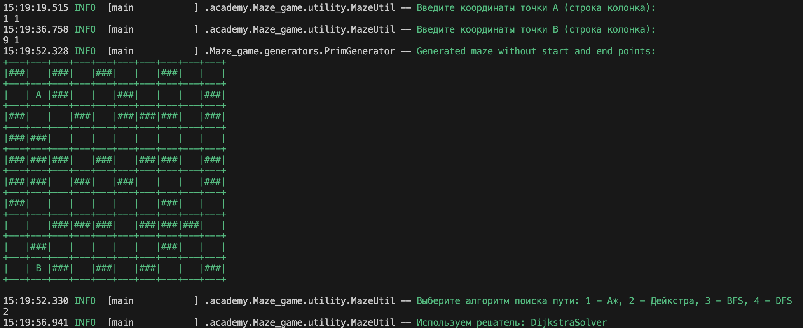
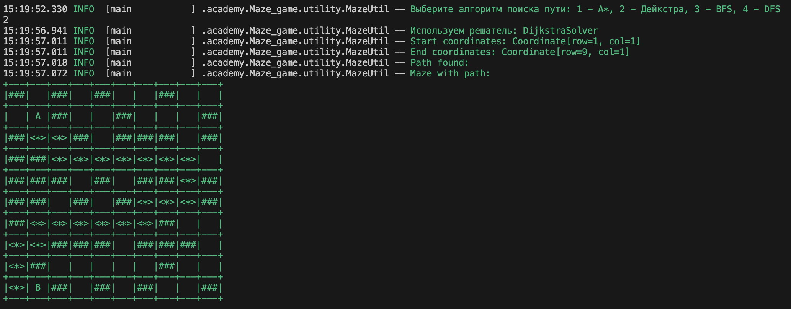

# Проект 2: Лабиринты

## Описание
Проект представляет собой консольную программу для генерации лабиринтов и поиска пути в них. Программа способна генерировать лабиринты различной сложности и размеров, а также предоставляет несколько методов поиска пути от заданной точки А (начала) к точке Б (конца). Интерфейс приложения простой и понятный, с возможностью отрисовки в консоли лабиринта и найденного пути.


## Реализация
В рамках проекта были реализованы следующие функциональные возможности:
- Генерация лабиринтов с использованием различных алгоритмов.
- Поиск пути в лабиринте с использованием нескольких алгоритмов, таких как A*, Дейкстра, BFS и DFS.
- Визуализация лабиринта и найденного пути в консоли.

### Пример работы программы
На изображении ниже показано, как программа работает в консоли. Пользователь выбирает алгоритм поиска пути, после чего программа генерирует лабиринт и находит путь от начальной точки А до конечной точки Б.





## Функциональные требования
- Реализовано как минимум два алгоритма для случайной генерации лабиринтов.
- Реализовано как минимум два алгоритма для поиска пути из заданной начальной точки А в конечную точку Б.
- Печать лабиринта в консоль с точками А и Б.
- Отображение пути через лабиринт при его наличии.

## Нефункциональные требования
- Код написан ясно и структурировано.
- Программа имеет текстовый интерфейс.
- Наличие документации по использованию, а также по алгоритмам генерации и решения лабиринта.

## Вывод
В результате выполнения проекта удалось создать полноценную консольную программу для генерации и решения лабиринтов. Программа корректно работает с различными алгоритмами генерации и поиска пути, обеспечивая наглядное представление результатов в консоли. Это позволяет эффективно использовать программу для учебных и исследовательских целей.

## Дополнительные материалы
- О генерации лабиринтов: [https://habr.com/ru/articles/445378/](https://habr.com/ru/articles/445378/)
- Поиск в глубину: [https://ru.algorithmica.org/cs/graph-traversals](https://ru.algorithmica.org/cs/graph-traversals)
- Поиск в ширину: [https://ru.algorithmica.org/cs/shortest-paths](https://ru.algorithmica.org/cs/shortest-paths)
- Unicode-символы для лабиринта: [https://www.vidarholen.net/cgi-bin/labyrinth](https://www.vidarholen.net/cgi-bin/labyrinth)


--- 

## Структура проекта

Это типовой Java-проект, который собирается с помощью инструмента автоматической
сборки проектов [Apache Maven](https://maven.apache.org/).

Проект состоит из следующих директорий и файлов:

- [pom.xml](./pom.xml) – дескриптор сборки, используемый maven, или Project
  Object Model. В нем описаны зависимости проекта и шаги по его сборке
- [src/](./src) – директория, которая содержит исходный код приложения и его
  тесты:
  - [src/main/](./src/main) – здесь находится код вашего приложения
  - [src/test/](./src/test) – здесь находятся тесты вашего приложения
- [mvnw](./mvnw) и [mvnw.cmd](./mvnw.cmd) – скрипты maven wrapper для Unix и
  Windows, которые позволяют запускать команды maven без локальной установки
- [checkstyle.xml](checkstyle.xml),
  [checkstyle-suppression.xml](checkstyle-suppression.xml), [pmd.xml](pmd.xml) и
  [spotbugs-excludes.xml](spotbugs-excludes.xml) – в проекте используются
  [линтеры](https://en.wikipedia.org/wiki/Lint_%28software%29) для контроля
  качества кода. Указанные файлы содержат правила для используемых линтеров
- [.mvn/](./.mvn) – служебная директория maven, содержащая конфигурационные
  параметры сборщика
- [lombok.config](lombok.config) – конфигурационный файл
  [Lombok](https://projectlombok.org/), библиотеки помогающей избежать рутинного
  написания шаблонного кода
- [.editorconfig](.editorconfig) – файл с описанием настроек форматирования кода
- [.github/workflows/build.yml](.github/workflows/build.yml) – файл с описанием
  шагов сборки проекта в среде Github
- [.gitattributes](.gitattributes), [.gitignore](.gitignore) – служебные файлы
  для git, с описанием того, как обрабатывать различные файлы, и какие из них
  игнорировать

## Начало работы

Подробнее о том, как приступить к разработке, описано в разделах
[курса][course-url] `1.8 Настройка IDE`, `1.9 Работа с Git` и
`1.10 Настройка SSH`.

Для того чтобы собрать проект, и проверить, что все работает корректно, можно
запустить из модального окна IDEA
[Run Anything](https://www.jetbrains.com/help/idea/running-anything.html)
команду:

```shell
mvn clean verify
```

Альтернативно можно в терминале из корня проекта выполнить следующие команды.

Для Unix (Linux, macOS, Cygwin, WSL):

```shell
./mvnw clean verify
```

Для Windows:

```shell
mvnw.cmd clean verify
```

Для окончания сборки потребуется подождать какое-то время, пока maven скачает
все необходимые зависимости, скомпилирует проект и прогонит базовый набор
тестов.

Если вы в процессе сборки получили ошибку:

```shell
Rule 0: org.apache.maven.enforcer.rules.version.RequireJavaVersion failed with message:
JDK version must be at least 22
```

Значит, версия вашего JDK ниже 22.

Если же получили ошибку:

```shell
Rule 1: org.apache.maven.enforcer.rules.version.RequireMavenVersion failed with message:
Maven version should, at least, be 3.8.8
```

Значит, у вас используется версия maven ниже 3.8.8. Такого не должно произойти,
если вы запускаете сборку из IDEA или через `mvnw`-скрипты.

Далее будут перечислены другие полезные команды maven.

Запуск только компиляции основных классов:

```shell
mvn compile
```

Запуск тестов:

```shell
mvn test
```

Запуск линтеров:

```shell
mvn checkstyle:check modernizer:modernizer spotbugs:check pmd:check pmd:cpd-check
```

Вывод дерева зависимостей проекта (полезно при отладке транзитивных
зависимостей):

```shell
mvn dependency:tree
```

Вывод вспомогательной информации о любом плагине (вместо `compiler` можно
подставить интересующий вас плагин):

```shell
mvn help:describe -Dplugin=compiler
```

## Дополнительные материалы

- Документация по maven: https://maven.apache.org/guides/index.html
- Поиск зависимостей и их версий: https://central.sonatype.com/search
- Документация по процессу автоматизированной сборки в среде github:
  https://docs.github.com/en/actions
- Документация по git: https://git-scm.com/doc
- Javadoc для Java 22:
  https://docs.oracle.com/en/java/javase/22/docs/api/index.html

[course-url]: https://edu.tinkoff.ru/all-activities/courses/870efa9d-7067-4713-97ae-7db256b73eab
